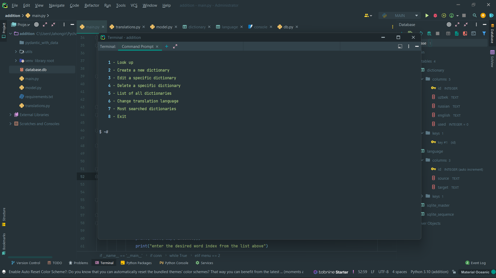
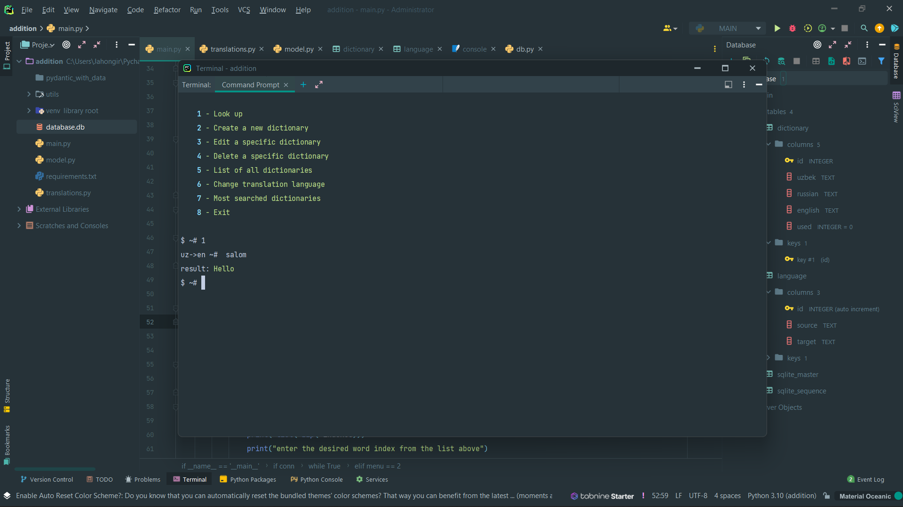
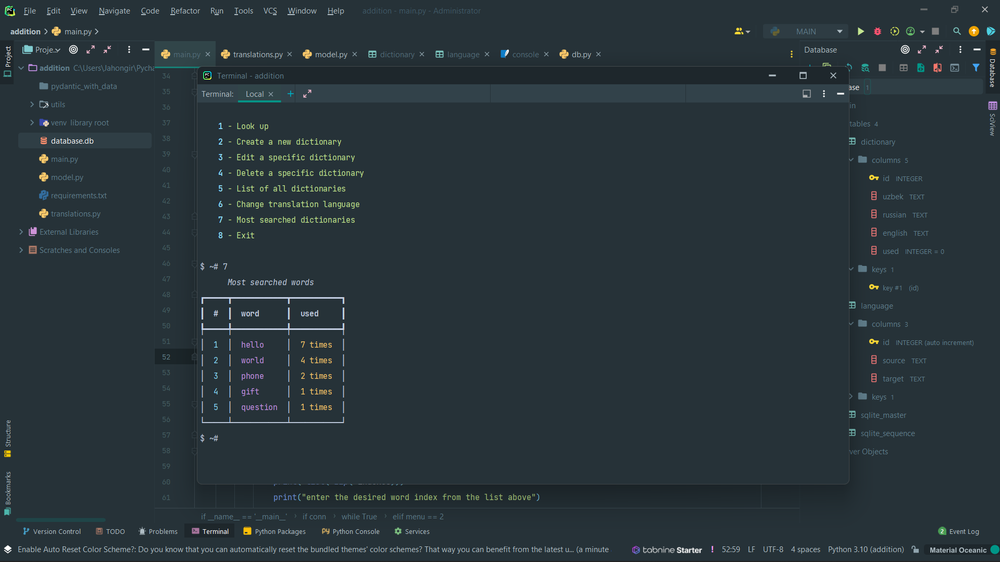

# dictionary-app-sqlite3
local mini dictionary works with sqlite3

**Install requirements**

Run :
```bash
$ pip3 install -r requirements.txt
```

### Screenshots
<p align="center">
  
  
</p>

<p align="center">
  
  
</p>
